# scalingo-staging-sync

[](https://rubygems.org/gems/scalingo-staging-sync)
[](https://www.ruby-toolbox.com/projects/scalingo-staging-sync)
[](https://github.com/navidemad/scalingo-staging-sync/actions/workflows/ci.yml)

Clone and anonymize Scalingo production databases for safe use in staging/demo environments

**Requirements:** PostgreSQL 16.x databases

## Quick start

Add the gem to your Gemfile inside your staging environment:
```ruby
gem 'scalingo-staging-sync', group: 'staging'
```

enable the gem with generate command

```bash
bundle exec rails generate scalingo_staging_sync:install
```

The generate command will auto generate the default configuration and may ask to include in the test environment as well. See below for custom configuration.

## Configuration

Configure the gem in your Rails initializer:

```ruby
# config/initializers/scalingo_staging_sync.rb
ScalingoStagingSync.configure do |config|
  config.clone_source_scalingo_app_name = "dummy-demo" # Scalingo app to clone from
  config.target_app = "dummy-staging" # Or use ENV["APP"] automatically
  config.slack_channel = "#deployments"
  config.slack_enabled = true
  config.exclude_tables = [
    "temp_data",
    "audit_logs",
  ]
  config.parallel_connections = 4
end
```

### Usage

```bash
# Clone production database to current environment
bundle exec rake scalingo_staging_sync:clone

# Test configuration and safety checks
bundle exec rake scalingo_staging_sync:test_clone
```

## Scheduling with Cron

For automated database cloning, create a `cron.json` file at the root of your project to schedule the clone task:

```json
{
  "jobs": [
    {
      "command": "0 7 * * 0 bundle exec rake scalingo_staging_sync:clone",
      "size": "2XL"
    }
  ]
}
```

This example runs the database clone every Sunday at 7:00 AM. Adjust the cron expression and dyno size according to your needs:

- **Cron format**: `minute hour day-of-month month day-of-week`
- **Size**: Choose appropriate dyno size (S, M, L, XL, 2XL, etc.) based on your database size
- **Common schedules**:
  - `0 7 * * 0` - Every Sunday at 7:00 AM
  - `0 2 * * 1` - Every Monday at 2:00 AM  
  - `0 8 */3 * *` - Every 3 days at 8:00 AM

Note: The cron job will only run in environments where the gem is installed (typically staging environments).

## Workflow

The gem follows a comprehensive workflow to safely clone and anonymize production databases:

```mermaid
flowchart TD
    A[Start: rake scalingo_database:clone] --> B{Safety Checks}
    B -->|Pass| C[Initialize Services]
    B -->|Fail| Z[❌ Abort with Error]
    
    C --> D[📢 Slack: Starting Clone]
    D --> E[🔍 Find PostgreSQL Addon]
    E --> F[📦 Request Backup from Scalingo]
    
    F --> G{Backup Ready?}
    G -->|No| H[⏳ Wait & Poll Status]
    H --> G
    G -->|Yes| I[⬇️ Download Backup]
    
    I --> J[🗂️ Extract & Validate Files]
    J --> K[📢 Slack: Starting Restore]
    K --> L[🗃️ Drop Existing Database]
    L --> M[🆕 Create Fresh Database]
    
    M --> N{pg_restore Available?}
    N -->|Yes| O[🔄 Restore with pg_restore]
    N -->|No| P[🔄 Restore with psql]
    
    O --> Q[📢 Slack: Starting Anonymization]
    P --> Q
    Q --> R[🔒 Anonymize Sensitive Data]
    R --> S[🧹 Clean Temporary Files]
    S --> T[📢 Slack: Clone Complete]
    T --> U[✅ Success]

    style A fill:#e1f5fe
    style Z fill:#ffebee
    style U fill:#e8f5e8
    style D fill:#fff3e0
    style K fill:#fff3e0
    style Q fill:#fff3e0
    style T fill:#fff3e0
```



### Key Components

- **Coordinator**: Orchestrates the entire process
- **DatabaseBackupService**: Handles Scalingo API interactions and backup downloads
- **DatabaseRestoreService**: Manages database restoration with table filtering
- **DatabaseAnonymizerService**: Anonymizes sensitive data in parallel
- **SlackNotificationService**: Provides real-time status updates

## Support

If you want to report a bug, or have ideas, feedback or questions about the gem, [let me know via GitHub issues](https://github.com/navidemad/scalingo-staging-sync/issues/new) and I will do my best to provide a helpful answer. Happy hacking!

## License

The gem is available as open source under the terms of the [MIT License](LICENSE.txt).

## Code of conduct

Everyone interacting in this project’s codebases, issue trackers, chat rooms and mailing lists is expected to follow the [code of conduct](CODE_OF_CONDUCT.md).

## Contribution guide

Pull requests are welcome!
