<div align="center">

# 🔄 scalingo-staging-sync

<p align="center">
  <strong>Safely clone and anonymize Scalingo production databases for staging environments</strong><br>
  <em>Never worry about GDPR compliance in your demo environments again</em>
</p>

<p align="center">
  <a href="https://rubygems.org/gems/scalingo-staging-sync">📦 RubyGems</a> •
  <a href="https://github.com/navidemad/scalingo-staging-sync/wiki">📚 Documentation</a> •
  <a href="#-live-demo">🎬 Demo</a> •
  <a href="https://github.com/navidemad/scalingo-staging-sync/releases">📝 Changelog</a> •
  <a href="#-getting-help">💬 Support</a>
</p>

<p align="center">
  <!-- Build & Version Info -->
  <a href="https://rubygems.org/gems/scalingo-staging-sync">
    
  </a>
  <a href="https://github.com/navidemad/scalingo-staging-sync/actions/workflows/ci.yml">
    
  </a>
  <a href="https://github.com/navidemad/scalingo-staging-sync/releases">
    
  </a>
  <a href="LICENSE.txt">
    
  </a>
  <br>
  <!-- Usage & Community -->
  <a href="https://www.ruby-toolbox.com/projects/scalingo-staging-sync">
    
  </a>
  <a href="https://github.com/navidemad/scalingo-staging-sync/stargazers">
    
  </a>
  <a href="https://github.com/navidemad/scalingo-staging-sync/network">
    
  </a>
  <a href="https://github.com/navidemad/scalingo-staging-sync/issues">
    
  </a>
  <br>
  <!-- Requirements -->
  
  
  
  
</p>

<p align="center">
  <a href="#-quick-start---2-minutes-to-safety">Quick Start</a> •
  <a href="#-live-demo">Demo</a> •
  <a href="#️-configuration">Configuration</a> •
  <a href="#-features">Features</a> •
  <a href="#-how-it-works">Workflow</a> •
  <a href="#-troubleshooting">Troubleshooting</a> •
  <a href="#-contributing">Contributing</a>
</p>

</div>

---

## 📋 Table of Contents

<details open>
<summary>Click to expand</summary>

- [🔄 scalingo-staging-sync](#-scalingo-staging-sync)
  - [📋 Table of Contents](#-table-of-contents)
  - [🎯 Quick Actions](#-quick-actions)
  - [🤔 Why scalingo-staging-sync?](#-why-scalingo-staging-sync)
  - [💭 Philosophy \& Story](#-philosophy--story)
    - [📖 Why We Built This](#-why-we-built-this)
  - [✨ Features](#-features)
    - [🔒 Security First](#-security-first)
    - [⚡ High Performance](#-high-performance)
    - [🎯 Developer Experience](#-developer-experience)
  - [🛠️ Technology Stack](#️-technology-stack)
  - [🚀 Quick Start - 2 Minutes to Safety](#-quick-start---2-minutes-to-safety)
  - [⚙️ Configuration](#️-configuration)
    - [📝 Basic Configuration](#-basic-configuration)
      - [Complex Join-Based Anonymization](#complex-join-based-anonymization)
    - [Multi-Environment Setup](#multi-environment-setup)
    - [Industry-Specific Templates](#industry-specific-templates)
  - [🛡️ Safety Features](#️-safety-features)
  - [⏰ Scheduling Automated Clones](#-scheduling-automated-clones)
  - [🔄 How It Works](#-how-it-works)
    - [1️⃣ Safety Checks](#1️⃣-safety-checks)
    - [2️⃣ Backup Creation](#2️⃣-backup-creation)
    - [3️⃣ Data Transfer](#3️⃣-data-transfer)
    - [4️⃣ Database Restoration](#4️⃣-database-restoration)
    - [5️⃣ Data Anonymization](#5️⃣-data-anonymization)
    - [6️⃣ Post-Processing](#6️⃣-post-processing)
    - [🏗️ Architecture Components](#️-architecture-components)
    - [📁 Project Structure](#-project-structure)
  - [💼 Real-World Examples](#-real-world-examples)
    - [🛍️ E-commerce Platform](#️-e-commerce-platform)
    - [☁️ SaaS Application](#️-saas-application)
  - [❓ Frequently Asked Questions](#-frequently-asked-questions)
    - [Getting Started](#getting-started)
    - [Configuration](#configuration)
    - [Troubleshooting](#troubleshooting)
  - [🔄 Alternative Tools](#-alternative-tools)
  - [🐛 Troubleshooting](#-troubleshooting)
    - [❌ Common Issues](#-common-issues)
    - [✅ Testing Your Configuration](#-testing-your-configuration)
  - [📊 Performance \& Benchmarks](#-performance--benchmarks)
    - [⚡ Speed Comparison](#-speed-comparison)
    - [📈 Performance Metrics](#-performance-metrics)
    - [🚀 Optimization Tips](#-optimization-tips)
  - [🤝 Contributing](#-contributing)
    - [🔧 Development Setup](#-development-setup)
    - [📤 Submitting Changes](#-submitting-changes)
    - [👥 Contributors](#-contributors)
  - [💬 Getting Help](#-getting-help)
    - [🚨 Found a Bug?](#-found-a-bug)
    - [💡 Have an Idea?](#-have-an-idea)
  - [📝 Changelog](#-changelog)
  - [🗺️ Roadmap](#️-roadmap)
  - [📄 License](#-license)
  - [📜 Code of Conduct](#-code-of-conduct)
  - [💎 Credits \& Dependencies](#-credits--dependencies)
    - [Core Dependencies](#core-dependencies)
    - [Development Tools](#development-tools)
  - [🙏 Acknowledgments](#-acknowledgments)
    - [🏆 Special Thanks](#-special-thanks)
    - [⭐ If you find this gem useful, please consider giving it a star on GitHub!](#-if-you-find-this-gem-useful-please-consider-giving-it-a-star-on-github)
    - [📢 Share This Project](#-share-this-project)

</details>

## 🎯 Quick Actions

<div align="center">

<a href="https://rubygems.org/gems/scalingo-staging-sync">
  
</a>
<a href="https://github.com/navidemad/scalingo-staging-sync/issues/new?template=bug_report.md">
  
</a>
<a href="https://github.com/navidemad/scalingo-staging-sync/issues/new?template=feature_request.md">
  
</a>
<a href="https://github.com/navidemad/scalingo-staging-sync/discussions">
  
</a>

</div>

## 🤔 Why scalingo-staging-sync?

Production data is invaluable for testing and demos, but using it directly poses serious risks:

- **🔐 Data Privacy**: GDPR and other regulations prohibit using real customer data in non-production environments
- **⚠️ Accidental Modifications**: One wrong command in staging could affect real customer data
- **📊 Realistic Testing**: Synthetic data never captures the complexity of production edge cases
- **⏰ Time-Consuming**: Manual database cloning and anonymization takes hours of developer time

**This gem solves all these problems** by providing an automated, safe, and configurable way to clone production databases with built-in anonymization, parallel processing for speed, and safety checks to prevent accidents.

## 💭 Philosophy & Story

> **Built for Production Reality** - We believe staging environments should mirror production complexity without compromising data privacy.

### 📖 Why We Built This

Every developer has been there: you need realistic data to test that critical feature, but using production data directly is risky and often illegal. Manual anonymization takes hours and is error-prone. Synthetic data never captures those edge cases that only appear in production.

We built scalingo-staging-sync because we needed a better way. A way that's:

- **🎯 Developer First**: Zero-config defaults that just work, with clear error messages and actionable solutions
- **🔒 Privacy by Design**: GDPR compliance isn't an afterthought—it's built into every operation
- **⚡ Performance Focused**: Parallel processing that doesn't sacrifice safety for speed
- **🔧 Fully Configurable**: Sensible defaults with complete customization for edge cases
- **🤝 Community Driven**: Built by developers, for developers, with your feedback shaping every feature

## ✨ Features

<table>
<tr>
<td width="33%">

### 🔒 Security First
- Multi-factor production protection
- Interactive confirmation mode
- Automatic PII detection
- GDPR compliant anonymization
- Transaction-wrapped with rollback
- Dry-run mode for safety

</td>
<td width="33%">

### ⚡ High Performance
- Parallel processing (3x faster)
- Smart table filtering
- Optimized for large databases
- Zero production impact

</td>
<td width="33%">

### 🎯 Developer Experience
- Rails native integration
- Slack notifications
- Detailed error messages
- Automated scheduling

</td>
</tr>
</table>

## 🛠️ Technology Stack

<p align="center">
  
  
  
  
  
</p>

## 🚀 Quick Start - 2 Minutes to Safety

1. **Add to your staging Gemfile:**
```ruby
gem 'scalingo-staging-sync', group: 'staging'
```

2. **Install and generate configuration:**
```bash
bundle install
bundle exec rails generate scalingo_staging_sync:install
```

3. **Set your Scalingo API token:**
```bash
scalingo env-set SCALINGO_API_TOKEN=<your-token>
```

4. **Clone your first database:**
```bash
bundle exec rake scalingo_staging_sync:run
```

That's it! Your staging database now contains safe, anonymized production data.

## ⚙️ Configuration

### 📝 Basic Configuration

After running the generator, configure your initializer:

```ruby
# config/initializers/scalingo_staging_sync.rb
ScalingoStagingSync.configure do |config|
  # ===== REQUIRED CONFIGURATION =====

  # Source app to clone from
  config.clone_source_scalingo_app_name = "my-app-production"

  # ===== SECURITY SETTINGS =====

  # Production protection patterns (default: [/prod/i, /production/i])
  config.production_hostname_patterns = [/prod/i, /production/i]
  config.production_app_name_patterns = [/prod/i, /production/i]

  # Interactive confirmation before running (default: false)
  config.require_confirmation = false

  # Dry-run mode - logs operations without executing (default: false)
  config.dry_run = false

  # ===== ANONYMIZATION CONFIGURATION =====

  # Configure tables to anonymize with built-in or custom strategies
  config.anonymization_tables = [
    { table: "users", strategy: :user_anonymization, translation: "utilisateurs" },
    { table: "phone_numbers", strategy: :phone_anonymization, translation: "téléphones" },
    { table: "payment_methods", strategy: :payment_anonymization, translation: "moyens de paiement" },
    { table: "addresses", strategy: :address_anonymization },
    { table: "emails", strategy: :email_anonymization }
    # Custom SQL query example:
    # { table: "custom_table", query: "UPDATE custom_table SET field = NULL WHERE condition" }
  ]

  # Transaction and error handling
  config.anonymization_rollback_on_error = true  # Rollback on failure (default: true)
  config.anonymization_retry_attempts = 3        # Retry attempts (default: 3)
  config.anonymization_retry_delay = 1.0         # Delay between retries in seconds (default: 1.0)

  # Anonymization verification and audit
  config.verify_anonymization = true                    # Verify anonymization succeeded (default: true)
  config.fail_on_verification_error = true              # Fail if verification fails (default: true)
  config.anonymization_audit_file = "tmp/anonymization_audit.json"  # Save audit report (optional)

  # PII detection scanner
  config.run_pii_scan = true                            # Scan for unanonymized PII (default: true)
  config.pii_detection_patterns = {                     # Custom PII patterns (optional, uses defaults if nil)
    identity: /\b(ssn|social_security|tax_id)\b/i,
    contact: /\b(email|phone|address)\b/i,
    financial: /\b(credit_card|iban|account_number)\b/i
  }

  # ===== PERFORMANCE SETTINGS =====

  # Parallel processing connections (default: 3)
  config.parallel_connections = 4

  # Tables to exclude from cloning (default: [])
  config.exclude_tables = ["sessions", "audit_logs", "temporary_data"]

  # ===== SLACK NOTIFICATIONS =====

  config.slack_webhook_url = ENV["SLACK_WEBHOOK_URL"]
  config.slack_channel = "#deployments"
  config.slack_enabled = true

  # ===== OTHER SETTINGS =====

  # Run seeds after cloning (optional)
  config.seeds_file_path = "db/demo_seeds.rb"

  # PostGIS extension support (default: false)
  config.postgis = false
end
```

<details>
<summary>🔧 <strong>Advanced Anonymization Strategies</strong></summary>

## Built-in Anonymization Strategies

The gem provides 5 built-in strategies for common data types:

### 1. User Anonymization (`:user_anonymization`)
Anonymizes user identity, address, and authentication data:
- Email addresses (SHA256 hashed)
- Names (replaced with "Demo User" + ID)
- Credit card and IBAN numbers
- Social auth tokens (Stripe, Google, Facebook, Apple)
- Birth dates and addresses

### 2. Phone Anonymization (`:phone_anonymization`)
Generates consistent fake phone numbers based on user/record ID:
- Format: `060` + 7-digit padded ID
- Example: `0600000123` for user ID 123

### 3. Payment Anonymization (`:payment_anonymization`)
Anonymizes payment method details:
- Card last 4 digits set to `0000`

### 4. Email Anonymization (`:email_anonymization`)
Simple email-only anonymization:
- Replaces with SHA256 hash + `@demo.example.com`

### 5. Address Anonymization (`:address_anonymization`)
Replaces address fields with generic values:
- Street: `123 Demo Street`
- City: `Demo City`
- Postal code: `00000`

## Custom Anonymization Strategies

You can register your own strategies for reusable anonymization patterns:

```ruby
# In config/initializers/scalingo_staging_sync.rb or before configuration

# Register a custom strategy
ScalingoStagingSync::Database::AnonymizationStrategies.register_strategy(:hipaa_patient) do |table, condition|
  query = <<~SQL.squish
    UPDATE #{table}
    SET
      patient_name = 'Patient ' || id,
      ssn = 'XXX-XX-XXXX',
      medical_record_number = 'MRN' || LPAD(id::text, 8, '0'),
      date_of_birth = DATE '1990-01-01',
      diagnosis = 'REDACTED',
      insurance_number = NULL
  SQL

  query += " WHERE #{condition}" if condition
  query
end

# Use the custom strategy in configuration
ScalingoStagingSync.configure do |config|
  config.anonymization_tables = [
    { table: "patients", strategy: :hipaa_patient },
    { table: "medical_records", strategy: :hipaa_patient }
  ]
end
```

## Custom SQL Queries

For one-off anonymization needs, use inline SQL queries:

```ruby
config.anonymization_tables = [
  # Simple update
  {
    table: "api_keys",
    query: "UPDATE api_keys SET key_hash = NULL, secret = NULL"
  },

  # Conditional anonymization
  {
    table: "orders",
    query: "UPDATE orders SET customer_notes = 'REDACTED'",
    condition: "created_at < NOW() - INTERVAL '1 year'"
  },

  # Complex transformation
  {
    table: "transactions",
    query: <<~SQL.squish
      UPDATE transactions
      SET
        amount = ROUND(RANDOM() * 1000, 2),
        account_id = NULL,
        reference_number = 'REF' || id
    SQL
  }
]
```

## Conditional Anonymization

Use the `:condition` key to anonymize only specific rows:

```ruby
config.anonymization_tables = [
  {
    table: "users",
    strategy: :user_anonymization,
    condition: "anonymized_at IS NULL"  # Only anonymize once
  },
  {
    table: "comments",
    strategy: :user_anonymization,
    condition: "created_at < NOW() - INTERVAL '90 days'"  # Only old comments
  }
]
```

## Anonymization with Verification

The gem automatically verifies anonymization succeeded:

```ruby
config.verify_anonymization = true         # Enable verification (default: true)
config.fail_on_verification_error = true   # Stop on verification failure (default: true)

# Custom PII patterns for verification
config.pii_detection_patterns = {
  identity: /\b(ssn|passport|driver_license)\b/i,
  contact: /\b(email|phone|address)\b/i,
  financial: /\b(credit_card|iban|routing)\b/i,
  medical: /\b(diagnosis|prescription|medical_record)\b/i
}
```

## Audit Trail

Generate detailed audit reports of anonymization operations:

```ruby
config.anonymization_audit_file = "tmp/anonymization_audit.json"

# Generates two files:
# - tmp/anonymization_audit.json (machine-readable JSON)
# - tmp/anonymization_audit.txt (human-readable report)
```

The audit report includes:
- Tables anonymized and row counts
- Verification results for each table
- PII scan results before and after
- Timestamp and duration of operations

</details>

<details>
<summary>🏢 <strong>Enterprise Configuration</strong></summary>

### Multi-Environment Setup
```ruby
# config/initializers/scalingo_staging_sync.rb
case Rails.env
when 'staging'
  config.clone_source_scalingo_app_name = "app-production"
  config.slack_channel = "#staging-deployments"
when 'demo'  
  config.clone_source_scalingo_app_name = "app-staging"
  config.slack_channel = "#demo-deployments"
end
```

### Industry-Specific Templates
```ruby
# Healthcare compliance
config.anonymization_rules = {
  "patients" => {
    "name" => "CONCAT('Patient ', id)",
    "ssn" => "'XXX-XX-XXXX'",
    "dob" => "DATE '1990-01-01'",
    "medical_record_number" => "CONCAT('MRN', LPAD(id::text, 8, '0'))"
  }
}

# Financial services
config.anonymization_rules = {
  "accounts" => {
    "account_number" => "CONCAT('****', RIGHT(id::text, 4))",
    "routing_number" => "'021000021'",
    "balance" => "ROUND(RANDOM() * 10000, 2)"
  }
}
```

</details>

## 🛡️ Safety Features

This gem includes comprehensive safety mechanisms to protect your production data:

| Feature | Description | Status |
|---------|-------------|--------|
| 🚫 **Multi-Factor Production Guard** | Checks Rails.env, APP name, and database hostname patterns | ✅ Enabled |
| 🔐 **Interactive Confirmation** | Requires typing target app name before proceeding | ⚙️ Configurable |
| 🔍 **Dry-Run Mode** | Simulates operations without executing changes | ⚙️ Configurable |
| 🔒 **Command Injection Protection** | Sanitizes all SQL identifiers and parameters | ✅ Enabled |
| 🔄 **Transaction Rollback** | Wraps anonymization in transactions with automatic rollback | ✅ Enabled |
| ♻️ **Retry Logic** | Retries failed operations with exponential backoff | ✅ Enabled (3 attempts) |
| ✓ **Anonymization Verification** | Verifies PII was successfully anonymized | ✅ Enabled |
| 🔍 **PII Scanner** | Detects unanonymized PII columns across all tables | ✅ Enabled |
| 📊 **Audit Trail** | Generates detailed JSON/text reports of all operations | ⚙️ Configurable |
| 🎯 **Column Validation** | Pre-checks all required columns exist before anonymization | ✅ Enabled |

### Production Protection Details

The gem uses **three layers of protection** to prevent accidental production usage:

1. **Rails Environment Check**: Blocks if `Rails.env.production?` returns true
2. **APP Name Pattern Check**: Blocks if `ENV['APP']` matches production patterns (default: `/prod/i`, `/production/i`)
3. **Database Hostname Check**: Blocks if database URL hostname matches production patterns

You can customize these patterns in your configuration:

```ruby
config.production_hostname_patterns = [/prod/i, /production/i, /eu-west-1\.rds\.amazonaws\.com/]
config.production_app_name_patterns = [/prod/i, /production/i, /-main$/]
```

### Interactive Confirmation Mode

For extra safety in sensitive environments, enable interactive confirmation:

```ruby
config.require_confirmation = true
```

This will prompt the operator to type the exact target app name before proceeding:

```
[CONFIRMATION REQUIRED] Type 'my-staging-app' to continue: _
```

**Note**: Interactive confirmation is automatically skipped in CI environments (when `CI=true`).

### Dry-Run Mode

Test your configuration without making any changes:

```ruby
config.dry_run = true
```

Or via environment variable:

```bash
DRY_RUN=true bundle exec rake scalingo_staging_sync:run
```

In dry-run mode:
- All operations are logged but not executed
- No database changes are made
- Configuration is validated
- Perfect for testing new anonymization strategies

## 📖 Configuration Reference

### All Configuration Options

Here's a complete reference of all available configuration options:

| Category | Option | Type | Default | Description |
|----------|--------|------|---------|-------------|
| **Required** |
| | `clone_source_scalingo_app_name` | String | `"your-production-app"` | Scalingo app name to clone from |
| **Security** |
| | `production_hostname_patterns` | Array\<Regex\> | `[/prod/i, /production/i]` | Patterns to detect production database hostnames |
| | `production_app_name_patterns` | Array\<Regex\> | `[/prod/i, /production/i]` | Patterns to detect production app names |
| | `require_confirmation` | Boolean | `false` | Require interactive confirmation before running |
| | `dry_run` | Boolean | `false` | Simulation mode - logs without executing |
| **Anonymization** |
| | `anonymization_tables` | Array\<Hash\> | `[]` | Tables to anonymize with strategies/queries |
| | `anonymization_rollback_on_error` | Boolean | `true` | Rollback transaction on anonymization errors |
| | `anonymization_retry_attempts` | Integer | `3` | Number of retry attempts for failed operations |
| | `anonymization_retry_delay` | Float | `1.0` | Delay in seconds between retries |
| **Verification** |
| | `verify_anonymization` | Boolean | `true` | Verify anonymization succeeded |
| | `fail_on_verification_error` | Boolean | `true` | Fail if verification detects issues |
| | `pii_detection_patterns` | Hash | Built-in patterns | Custom regex patterns for PII detection |
| | `anonymization_audit_file` | String | `nil` | Path to save audit report (JSON + text) |
| | `run_pii_scan` | Boolean | `true` | Scan for unanonymized PII columns |
| **Performance** |
| | `parallel_connections` | Integer | `3` | Number of parallel database connections |
| | `exclude_tables` | Array\<String\> | `[]` | Tables to exclude from cloning |
| **Notifications** |
| | `slack_enabled` | Boolean | `false` | Enable Slack notifications |
| | `slack_webhook_url` | String | `nil` | Slack webhook URL |
| | `slack_channel` | String | `nil` | Slack channel name (e.g., "#deployments") |
| **Other** |
| | `seeds_file_path` | String | `nil` | Path to seeds file to run after cloning |
| | `postgis` | Boolean | `false` | Enable PostGIS extension support |
| | `logger` | Logger | `Rails.logger` | Custom logger instance |
| | `temp_dir` | String | `Rails.root.join("tmp")` | Directory for temporary files |
| **Read-Only** |
| | `target_app` | String | `ENV['APP']` | Target app name (auto-detected, not configurable) |

### Anonymization Tables Configuration

The `anonymization_tables` option accepts an array of hashes with these keys:

| Key | Type | Required | Description |
|-----|------|----------|-------------|
| `table` | String | Yes | Table name to anonymize |
| `strategy` | Symbol | No* | Built-in or custom strategy name (`:user_anonymization`, `:phone_anonymization`, etc.) |
| `query` | String | No* | Custom SQL UPDATE query |
| `condition` | String | No | WHERE clause condition to apply |
| `translation` | String | No | French translation for Slack notifications |

\* Must specify either `strategy` OR `query`, not both.

**Example:**
```ruby
config.anonymization_tables = [
  # Using built-in strategy
  { table: "users", strategy: :user_anonymization, translation: "utilisateurs" },

  # Using built-in strategy with condition
  { table: "comments", strategy: :user_anonymization, condition: "created_at < NOW() - INTERVAL '90 days'" },

  # Using custom SQL query
  { table: "api_keys", query: "UPDATE api_keys SET token = NULL, secret = NULL" },

  # Using custom SQL query with condition
  { table: "sessions", query: "UPDATE sessions SET data = '{}'", condition: "updated_at < NOW() - INTERVAL '7 days'" }
]
```

### Environment Variables

| Variable | Description | Example |
|----------|-------------|---------|
| `APP` | Target Scalingo app name (auto-set on Scalingo) | `my-staging-app` |
| `SCALINGO_API_TOKEN` | Scalingo API authentication token (required) | `tk-us-xxx...` |
| `DATABASE_URL` | Target database URL (auto-set on Scalingo) | `postgres://...` |
| `SCALINGO_POSTGRESQL_URL` | Alternative database URL (auto-set on Scalingo) | `postgres://...` |
| `DRY_RUN` | Enable dry-run mode via environment | `true` or `false` |
| `CI` | Indicates CI environment (skips confirmation) | `true` |
| `CONTINUOUS_INTEGRATION` | Alternative CI indicator | `true` |

## ⏰ Scheduling Automated Clones

Create a `cron.json` file at your project root:

```json
{
  "jobs": [
    {
      "command": "0 7 * * 0 bundle exec rake scalingo_staging_sync:run",
      "size": "2XL"
    }
  ]
}
```

**Popular schedules:**
- `0 7 * * 0` - Every Sunday at 7:00 AM UTC
- `0 2 * * 1` - Every Monday at 2:00 AM UTC
- `0 8 */3 * *` - Every 3 days at 8:00 AM UTC

**Size recommendations:**
- **S/M**: Databases under 1GB
- **L/XL**: Databases 1-10GB
- **2XL+**: Large databases over 10GB

Note: The cron job will only run in staging environments.

## 🔄 How It Works

The gem follows a comprehensive, safe workflow to clone and anonymize your production database:


<details>
<summary>📖 <strong>Detailed Process Steps</strong></summary>

### 1️⃣ Safety Checks
- Verify not running in production
- Validate configuration
- Check source and target app names

### 2️⃣ Backup Creation
- Connect to Scalingo API
- Request fresh backup
- Poll until ready

### 3️⃣ Data Transfer
- Download backup archive
- Extract SQL dump
- Filter excluded tables

### 4️⃣ Database Restoration
- Drop existing database
- Create fresh database
- Import filtered data

### 5️⃣ Data Anonymization
- Detect PII fields
- Apply anonymization rules
- Parallel processing for speed

### 6️⃣ Post-Processing
- Run seed files
- Send Slack notification
- Clean up temporary files

</details>

**📚 Detailed workflow documentation**: [WORKFLOW.md](WORKFLOW.md)

### 🏗️ Architecture Components

| Component | Purpose | Key Features |
|-----------|---------|--------------|
| **Coordinator** | Process orchestration | Error handling, rollback support |
| **DatabaseBackupService** | Scalingo API integration | Backup creation, download management |
| **DatabaseRestoreService** | Database restoration | Table filtering, safe restore |
| **DatabaseAnonymizerService** | Data anonymization | Parallel processing, PII detection |
| **SlackNotificationService** | Progress updates | Real-time notifications, error alerts |

### 📁 Project Structure

```
📦 scalingo-staging-sync/
├── 📚 lib/
│   ├── 🔄 scalingo_staging_sync/
│   │   ├── ⚙️ configuration.rb        # Configuration management
│   │   ├── 🚂 railtie.rb              # Rails integration
│   │   ├── 📌 version.rb              # Version constant
│   │   ├── 🎯 services/               # Core service classes
│   │   │   ├── coordinator.rb
│   │   │   ├── database_anonymizer_service.rb
│   │   │   ├── database_backup_service.rb
│   │   │   └── database_restore_service.rb
│   │   ├── 💾 database/               # Database utilities
│   │   ├── 🔌 integrations/           # External services
│   │   ├── 🛠️ support/                # Helper modules
│   │   └── 🧪 testing/                # Test utilities
│   ├── 🎨 generators/                 # Rails generators
│   └── 📋 tasks/                      # Rake tasks
├── 🧪 test/                           # Test suite
├── 📖 README.md                       # You are here
└── 📦 Gemfile                         # Dependencies
```

## 💼 Real-World Examples

### 🛍️ E-commerce Platform
```ruby
ScalingoStagingSync.configure do |config|
  config.clone_source_scalingo_app_name = "shop-production"
  config.exclude_tables = ["payment_logs", "sessions", "carts"]
  config.anonymization_rules = {
    "customers" => {
      "email" => "CONCAT('customer', id, '@demo.test')",
      "phone" => "'555-0100'",
      "credit_card" => "'4111111111111111'"
    },
    "orders" => {
      "shipping_address" => "'123 Demo Street'",
      "billing_address" => "'123 Demo Street'"
    }
  }
  config.seeds_file_path = "db/demo_products.rb"
end
```

### ☁️ SaaS Application
```ruby
ScalingoStagingSync.configure do |config|
  config.clone_source_scalingo_app_name = "saas-production"
  config.exclude_tables = ["audit_logs", "api_keys", "webhooks"]
  config.anonymization_rules = {
    "accounts" => {
      "company_name" => "CONCAT('Demo Company ', id)",
      "tax_id" => "'XX-XXXXXXX'"
    },
    "users" => {
      "email" => "CONCAT('user', id, '@', accounts.slug, '.demo')",
      "api_token" => "NULL"
    }
  }
  config.parallel_connections = 6  # Large user base
end
```

## ❓ Frequently Asked Questions

<details>
<summary><strong>Click to expand FAQ</strong></summary>

### Getting Started
**Q: Why choose this over manual database cloning?**  
A: Automated anonymization, safety checks, and parallel processing save hours of manual work while ensuring GDPR compliance.

**Q: Can I use this in production?**  
A: No, the gem has built-in production guards to prevent accidental usage in production environments.

**Q: What PostgreSQL versions are supported?**  
A: PostgreSQL 14.x, 15.x, and 16.x are fully supported and tested.

### Configuration
**Q: How do I exclude sensitive tables?**  
A: Use the `exclude_tables` configuration option to skip specific tables during cloning.

**Q: Can I customize anonymization rules?**  
A: Yes, provide custom SQL expressions via `anonymization_rules` configuration.

**Q: How do I test my configuration without running a full clone?**  
A: Run `bundle exec rake scalingo_staging_sync:check` for a dry run.

### Troubleshooting
**Q: The clone is taking too long, how can I speed it up?**  
A: Increase `parallel_connections` (default: 3, max: 8) and exclude unnecessary large tables.

**Q: I'm getting foreign key constraint errors**  
A: Add problematic tables to `exclude_tables` or ensure proper table ordering in restoration.

</details>

## 🔄 Alternative Tools

If scalingo-staging-sync doesn't meet your needs, consider these alternatives:

| Tool | Best For | Comparison |
|------|----------|------------|
| [pgreplay](https://github.com/laurenz/pgreplay) | Transaction replay | Better for performance testing |
| [pg_sample](https://github.com/mla/pg_sample) | Sampling large databases | Better for massive datasets |
| [pgcopydb](https://github.com/dimitri/pgcopydb) | Database migration | Better for one-time migrations |
| **scalingo-staging-sync** | **Staging environments** | **Best for recurring, safe staging data** |

## 🐛 Troubleshooting

<details>
<summary>📋 <strong>Common Issues and Solutions</strong></summary>

### ❌ Common Issues

**Backup download fails:**
```bash
# Check your API token is valid
scalingo whoami

# Ensure source app has database addon
scalingo -a your-app addons
```

**Anonymization takes too long:**
```ruby
# Increase parallel connections
config.parallel_connections = 8  # Default is 3
```

**Running out of disk space:**
```ruby
# Configure temp directory with more space
config.temp_dir = "/mnt/large-disk/tmp"
```

**Restoration fails with foreign key errors:**
```ruby
# Add problematic tables to exclusion list
config.exclude_tables += ["legacy_table", "orphaned_records"]
```

### ✅ Testing Your Configuration

Before scheduling automated clones, test your setup:

```bash
# Dry run to check configuration
bundle exec rake scalingo_staging_sync:check

# Run with verbose logging
VERBOSE=true bundle exec rake scalingo_staging_sync:run
```

</details>

## 📊 Performance & Benchmarks

### ⚡ Speed Comparison

```mermaid
graph LR
    A[Manual Process<br/>4+ hours] -->|❌| B[Error Prone]
    C[pg_dump Only<br/>2+ hours] -->|⚠️| D[No Anonymization]
    E[scalingo-staging-sync<br/>5-60 min] -->|✅| F[Safe & Automated]
    
    style E fill:#4CAF50,stroke:#333,stroke-width:2px
    style A fill:#f44336,stroke:#333,stroke-width:2px
    style C fill:#ff9800,stroke:#333,stroke-width:2px
```

<div align="center">



</div>

### 📈 Performance Metrics

| Database Size | Typical Duration | Recommended Dyno | Parallel Connections | Memory Usage |
|--------------|------------------|-------------------|---------------------|--------------|
| < 100 MB     | 2-5 minutes      | S                 | 2                   | < 512 MB     |
| 100 MB - 1 GB | 5-15 minutes    | M                 | 3                   | < 1 GB       |
| 1 - 5 GB     | 15-30 minutes    | L                 | 4                   | < 2 GB       |
| 5 - 10 GB    | 30-60 minutes    | XL                | 6                   | < 4 GB       |
| > 10 GB      | 60+ minutes      | 2XL               | 8                   | < 8 GB       |

### 🚀 Optimization Tips

<details>
<summary><strong>Click for performance optimization guide</strong></summary>

1. **Parallel Processing**
   ```ruby
   config.parallel_connections = 8  # Max for 2XL dynos
   ```

2. **Smart Table Exclusion**
   ```ruby
   config.exclude_tables = %w[
     audit_logs
     request_logs
     temporary_data
     cache_entries
   ]
   ```

3. **Optimal Scheduling**
   ```json
   {
     "command": "0 3 * * 0 bundle exec rake scalingo_staging_sync:run",
     "size": "2XL"
   }
   ```

4. **Memory Management**
   - Use streaming for large backups
   - Clean temporary files immediately
   - Monitor dyno memory usage

</details>

## 🤝 Contributing

We welcome contributions! Here's how to get started:

### 🔧 Development Setup

```bash
# Clone the repository
git clone https://github.com/navidemad/scalingo-staging-sync.git
cd scalingo-staging-sync

# Install dependencies
bin/setup

# Run tests
bundle exec rake test

# Run linter
bundle exec rubocop
```

### 📤 Submitting Changes

1. Fork the repository
2. Create your feature branch (`git checkout -b feature/amazing-feature`)
3. Commit your changes (`git commit -m 'Add amazing feature'`)
4. Push to the branch (`git push origin feature/amazing-feature`)
5. Open a Pull Request

See [CONTRIBUTING.md](CONTRIBUTING.md) for detailed guidelines.

### 👥 Contributors

<a href="https://github.com/navidemad/scalingo-staging-sync/graphs/contributors">
  
</a>

## 💬 Getting Help

We're here to help! No question is too small.

### 🚨 Found a Bug?
[Open an issue](https://github.com/navidemad/scalingo-staging-sync/issues/new?template=bug_report.md) with our bug report template

### 💡 Have an Idea?
[Request a feature](https://github.com/navidemad/scalingo-staging-sync/issues/new?template=feature_request.md) or start a [discussion](https://github.com/navidemad/scalingo-staging-sync/discussions)

## 📝 Changelog
[View Full Changelog](https://github.com/navidemad/scalingo-staging-sync/releases)

## 🗺️ Roadmap
See the [open issues](https://github.com/navidemad/scalingo-staging-sync/issues) for a full list of proposed features and vote on what you'd like to see next!

## 📄 License

The gem is available as open source under the terms of the [MIT License](LICENSE.txt).

## 📜 Code of Conduct

Everyone interacting in this project's codebases, issue trackers, chat rooms and mailing lists is expected to follow the [code of conduct](CODE_OF_CONDUCT.md).

## 💎 Credits & Dependencies

### Core Dependencies
- [**pg**](https://github.com/ged/ruby-pg) - PostgreSQL Ruby driver
- [**rails**](https://rubyonrails.org/) - Web application framework
- [**scalingo**](https://github.com/Scalingo/scalingo-ruby-api) - Scalingo API client
- [**zeitwerk**](https://github.com/fxn/zeitwerk) - Code autoloading

### Development Tools
- [**minitest**](https://github.com/minitest/minitest) - Testing framework
- [**rubocop**](https://github.com/rubocop/rubocop) - Ruby linter
- [**rake**](https://github.com/ruby/rake) - Build tool

## 🙏 Acknowledgments

- Built with ❤️ for the Scalingo community
- Inspired by the need for safe staging environments
- Thanks to all [contributors](https://github.com/navidemad/scalingo-staging-sync/graphs/contributors)

### 🏆 Special Thanks

- **Scalingo team** for their excellent platform and API
- **PostgreSQL community** for robust database tools
- **Ruby community** for amazing gems and support
- All users who have provided feedback and bug reports
- Open source maintainers whose projects inspire us

---

<div align="center">

### ⭐ If you find this gem useful, please consider giving it a star on GitHub!

<a href="https://github.com/navidemad/scalingo-staging-sync">
  
</a>

### 📢 Share This Project

<a href="https://twitter.com/intent/tweet?text=Check%20out%20scalingo-staging-sync%20-%20Safely%20clone%20and%20anonymize%20production%20databases%20for%20staging%20environments!&url=https://github.com/navidemad/scalingo-staging-sync">
  
</a>
<a href="https://www.linkedin.com/sharing/share-offsite/?url=https://github.com/navidemad/scalingo-staging-sync">
  
</a>
<a href="https://reddit.com/submit?url=https://github.com/navidemad/scalingo-staging-sync&title=Scalingo%20Staging%20Sync%20-%20Safe%20Database%20Cloning">
  
</a>

<br><br>

<a href="#-scalingo-staging-sync">⬆️ Back to Top</a>

</div>
