# scalingo-database-cloner

[](https://rubygems.org/gems/scalingo-database-cloner)
[](https://www.ruby-toolbox.com/projects/scalingo-database-cloner)
[](https://github.com/navidemad/scalingo-database-cloner/actions/workflows/ci.yml)

Clone and anonymize Scalingo production databases for safe use in staging/demo environments

**Requirements:** PostgreSQL 16.x databases

---

- [scalingo-database-cloner](#scalingo-database-cloner)
  - [Quick start](#quick-start)
  - [Configuration](#configuration)
  - [Workflow](#workflow)
  - [Support](#support)
  - [License](#license)
  - [Code of conduct](#code-of-conduct)
  - [Contribution guide](#contribution-guide)

## Quick start

```
gem install scalingo-database-cloner
```

```ruby
require "scalingo/database/cloner"
```

## Configuration

Configure the gem in your Rails initializer:

```ruby
# config/initializers/scalingo_database_cloner.rb
Scalingo::Database::Cloner.configure do |config|
  config.source_app = "yespark-demo"        # Scalingo app to clone from
  config.target_app = "yespark-staging"     # Or use ENV["APP"] automatically
  config.slack_channel = "#deployments"
  config.slack_enabled = true
  config.exclude_tables = ["temp_data", "audit_logs"]
  config.parallel_connections = 4
end
```

### Usage

```bash
# Clone production database to current environment
bundle exec rake scalingo_database:clone

# Test configuration and safety checks
bundle exec rake scalingo_database:test_clone
```

## Workflow

The gem follows a comprehensive workflow to safely clone and anonymize production databases:

```mermaid
flowchart TD
    A[Start: rake scalingo_database:clone] --> B{Safety Checks}
    B -->|Pass| C[Initialize Services]
    B -->|Fail| Z[❌ Abort with Error]
    
    C --> D[📢 Slack: Starting Clone]
    D --> E[🔍 Find PostgreSQL Addon]
    E --> F[📦 Request Backup from Scalingo]
    
    F --> G{Backup Ready?}
    G -->|No| H[⏳ Wait & Poll Status]
    H --> G
    G -->|Yes| I[⬇️ Download Backup]
    
    I --> J[🗂️ Extract & Validate Files]
    J --> K[📢 Slack: Starting Restore]
    K --> L[🗃️ Drop Existing Database]
    L --> M[🆕 Create Fresh Database]
    
    M --> N{pg_restore Available?}
    N -->|Yes| O[🔄 Restore with pg_restore]
    N -->|No| P[🔄 Restore with psql]
    
    O --> Q[📢 Slack: Starting Anonymization]
    P --> Q
    Q --> R[🔒 Anonymize Sensitive Data]
    R --> S[🧹 Clean Temporary Files]
    S --> T[📢 Slack: Clone Complete]
    T --> U[✅ Success]

    style A fill:#e1f5fe
    style Z fill:#ffebee
    style U fill:#e8f5e8
    style D fill:#fff3e0
    style K fill:#fff3e0
    style Q fill:#fff3e0
    style T fill:#fff3e0
```



### Key Components

- **StagingSyncCoordinator**: Orchestrates the entire process
- **DatabaseBackupService**: Handles Scalingo API interactions and backup downloads
- **DatabaseRestoreService**: Manages database restoration with table filtering
- **DatabaseAnonymizerService**: Anonymizes sensitive data in parallel
- **SlackNotificationService**: Provides real-time status updates

## Support

If you want to report a bug, or have ideas, feedback or questions about the gem, [let me know via GitHub issues](https://github.com/navidemad/scalingo-database-cloner/issues/new) and I will do my best to provide a helpful answer. Happy hacking!

## License

The gem is available as open source under the terms of the [MIT License](LICENSE.txt).

## Code of conduct

Everyone interacting in this project’s codebases, issue trackers, chat rooms and mailing lists is expected to follow the [code of conduct](CODE_OF_CONDUCT.md).

## Contribution guide

Pull requests are welcome!
