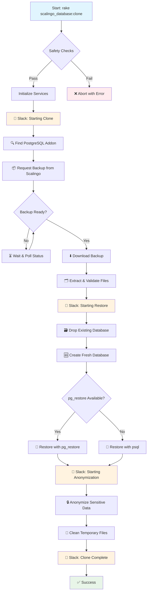

## Workflow

The gem follows a comprehensive workflow to safely clone and anonymize production databases: [WORKFLOW.md](WORKFLOW.md)

```mermaid
flowchart TD
    A[Start: rake scalingo_database:clone] --> B{Safety Checks}
    B -->|Pass| C[Initialize Services]
    B -->|Fail| Z[❌ Abort with Error]
    
    C --> D[📢 Slack: Starting Clone]
    D --> E[🔍 Find PostgreSQL Addon]
    E --> F[📦 Request Backup from Scalingo]
    
    F --> G{Backup Ready?}
    G -->|No| H[⏳ Wait & Poll Status]
    H --> G
    G -->|Yes| I[⬇️ Download Backup]
    
    I --> J[🗂️ Extract & Validate Files]
    J --> K[📢 Slack: Starting Restore]
    K --> L[🗃️ Drop Existing Database]
    L --> M[🆕 Create Fresh Database]
    
    M --> N{pg_restore Available?}
    N -->|Yes| O[🔄 Restore with pg_restore]
    N -->|No| P[🔄 Restore with psql]
    
    O --> Q[📢 Slack: Starting Anonymization]
    P --> Q
    Q --> R[🔒 Anonymize Sensitive Data]
    R --> S[🧹 Clean Temporary Files]
    S --> T[📢 Slack: Clone Complete]
    T --> U[✅ Success]

    style A fill:#e1f5fe
    style Z fill:#ffebee
    style U fill:#e8f5e8
    style D fill:#fff3e0
    style K fill:#fff3e0
    style Q fill:#fff3e0
    style T fill:#fff3e0
```